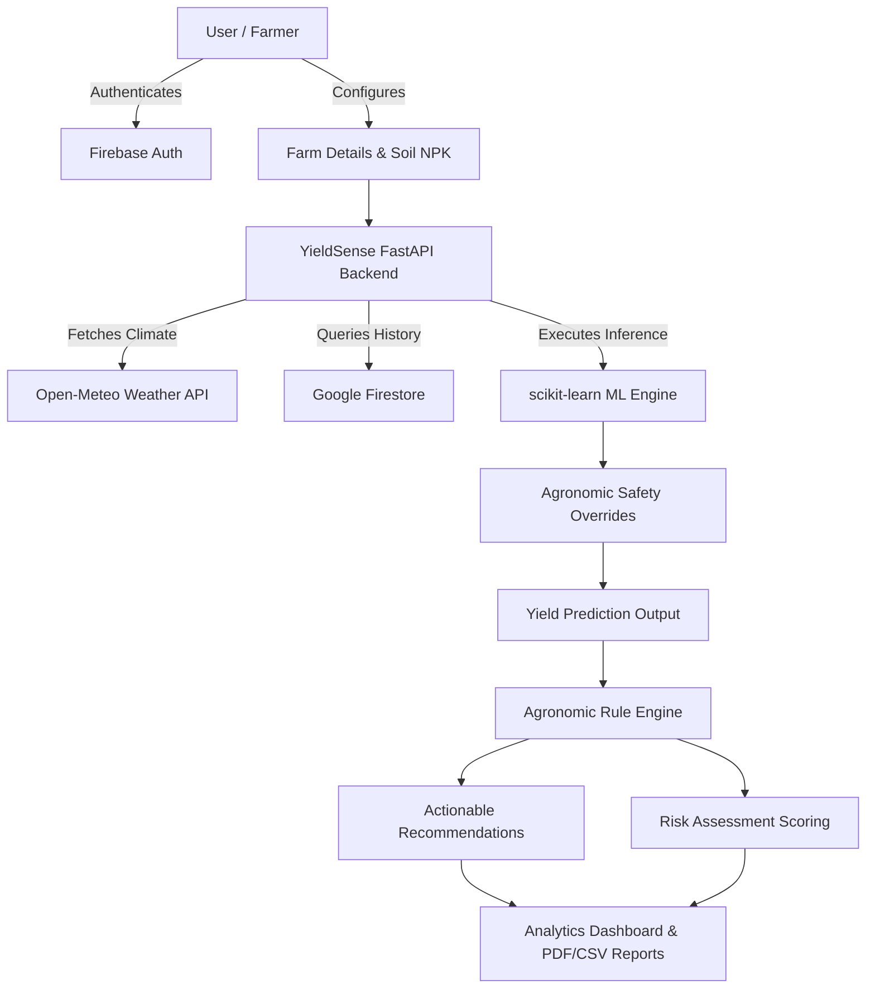
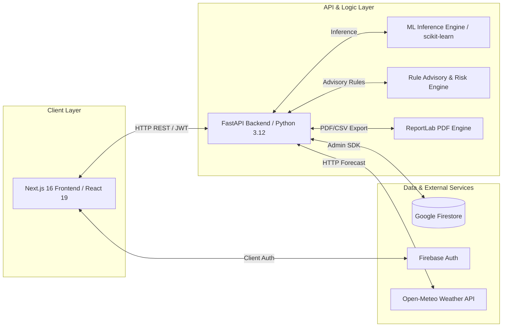

# 🌾 YieldSense AI

> AI-powered Crop Yield Prediction and Agricultural Productivity Forecasting System

[](https://nextjs.org/)
[](https://fastapi.tiangolo.com/)
[](https://firebase.google.com/)
[](https://www.typescriptlang.org/)
[](https://tailwindcss.com/)
[](LICENSE)

---

## 🌐 Live Deployment Links

- **Live Web Application (Vercel)**: [**https://yield-sense-ai.vercel.app**](https://yield-sense-ai.vercel.app/)
- **Live Backend API (Render)**: [**https://yieldsense-ai.onrender.com/api/v1**](https://yieldsense-ai.onrender.com/api/v1)
- **Interactive API Documentation (Swagger)**: [**https://yieldsense-ai.onrender.com/docs**](https://yieldsense-ai.onrender.com/docs)

---

## 📋 Overview

YieldSense AI is a full-stack agricultural decision-support platform designed to help farmers, agronomists, and agricultural administrators forecast crop production and manage farming risks. The application integrates historical agricultural production data, soil nutrient chemistry, live Open-Meteo weather forecasts, and dual machine learning inference pipelines to produce accurate yield forecasts and agronomic recommendations.

The platform provides a centralized workspace for managing farm locations, predicting crop yields, evaluating soil suitability, monitoring weather trends, generating analytical insights, downloading PDF/CSV executive reports, and conducting administrative user governance under multi-tenant data isolation.

---

## 🌟 Key Features

- **Crop Yield Prediction**: Regression model predicting expected yield in tons/hectare based on area, weather, temperature, rainfall, soil pH, and NPK nutrient levels.
- **Crop Recommendation**: Classification model identifying the optimal crop variety for specific soil chemistry and climate conditions.
- **Agronomic Safety Overrides**: Physical rule boundary layers forcing a 0.0 tons/ha output under extreme drought, freezing temperatures, severe pH degradation, or nutrient depletion.
- **Rule-Based Advisory Engine**: Explainable, deterministic recommendation engine translating soil pH, yield deviation vs. farm average, and rainfall deviation into plain-English farmer advice.
- **Agricultural Risk Assessment**: Point-based risk scoring system assessing yield risk, rainfall risk (drought and excess water), and soil stress to assign Low, Medium, or High risk levels.
- **Live Weather Integration**: Connects with Open-Meteo API to fetch current weather and 7-day daily forecasts with caching.
- **Soil Health Analyzer**: Evaluates NPK nutrient balance, pH status, and crop suitability.
- **Interactive Analytics Dashboard**: Live charts featuring Yield Trends, Crop Yield Comparisons, Season Performance, and Scatter Analysis (Rainfall vs. Yield).
- **Prediction History & Search**: Historical log of past predictions with search, pagination, detailed modal view, and record deletion.
- **Report & Export Engine**: Generates downloadable ReportLab PDF summary reports and raw CSV data exports.
- **Farm Management**: CRUD capabilities for farm attributes (location, area, soil pH, NPK, crop) stored in Firestore.
- **Multi-Tenant User Isolation**: Automatic user-scoped Firestore queries (`user_id == uid`) ensuring complete data separation between accounts.
- **Admin Control Center**: Dedicated administrative platform (`/admin`) with system KPIs, user role switching (`Farmer` ↔ `Admin`), system audit stream, and ML status monitoring.

---

## 🔄 Application Workflow



---

## 🏗️ System Architecture

YieldSense AI is built as a decoupled modern web application with a FastAPI backend, a Next.js frontend, Google Firestore for persistence, and scikit-learn for machine learning inference.



---

## 🛠️ Technology Stack

| Layer | Technologies |
|---|---|
| **Frontend** | Next.js 16 (App Router), React 19, TypeScript 5, Tailwind CSS 4, Lucide Icons, Recharts |
| **Backend** | Python 3.12, FastAPI 0.115, Pydantic v2, Uvicorn, ReportLab (PDF Engine) |
| **Machine Learning** | scikit-learn, joblib, NumPy, pandas, matplotlib, seaborn |
| **Persistence & Auth** | Google Cloud Firestore, Firebase Authentication, Firebase Admin Python SDK |
| **External APIs** | Open-Meteo Weather API |
| **Containerization** | Docker, Docker Compose |
| **Testing** | Pytest, Starlette TestClient, Postman |

---

## 🛠️ End-to-End Development Lifecycle Phases

The project development is organized into 9 software development phases:

- **PHASE 1  -  PROJECT FOUNDATION**: Setup FastAPI backend, Next.js frontend, Tailwind CSS design system tokens, and `/api/v1/health` endpoint.
- **PHASE 2  -  APPLICATION & AUTHENTICATION**: Client/Server Firebase Auth (Signup, Login, Profile); Firestore Farm CRUD with strict `user_id` multi-tenant data isolation.
- **PHASE 3  -  DATA MANAGEMENT & PREPROCESSING**: Preprocessing pipelines for `Crop_recommendation_processed.csv` and `yield_df_processed.csv`; One-Hot Encoding and `StandardScaler` transformations.
- **PHASE 4  -  MACHINE LEARNING & YIELD PREDICTION**: Random Forest crop recommendation model (99.32% Accuracy), tuned KNN yield prediction model ($R^2 = 0.9860$), physical safety overrides, live weather integration, soil analyzer.
- **PHASE 5  -  ANALYTICS & VISUALIZATION**: Dashboard summary statistics, interactive analytics charts (Yield Trend, Crop Comparison, Season Performance, Scatter Analysis), searchable prediction history.
- **PHASE 6  -  RECOMMENDATION & RISK ASSESSMENT**: Centralized agronomic thresholds, rule-based recommendation engine, point-based risk scoring, farm-linked advisory API (`GET /api/v1/recommendations/farm/{farm_id}`), `FarmAdvisoryPanel`.
- **PHASE 7  -  TESTING & DEPLOYMENT**: Automated Pytest suite (32 test modules passing), Postman collection (`YieldSense_AI.postman_collection.json`), production Dockerfiles, Docker Compose pipeline.
- **PHASE 8  -  MODEL & REPOSITORY MANAGEMENT**: Model validation on 20% held-out test data (`backend/ml/evaluate_test_set.py`, `backend/ml/evaluation_report.md`), secret removal, `.env.example` templates.
- **PHASE 9  -  FINAL QUALITY ASSURANCE**: Admin Control Center (`/admin`), ReportLab PDF and CSV export engine, production cloud deployment guide (`docs/deployment.md`), demonstration guide (`docs/demo_guide.md`).

---

## 🧠 Machine Learning Performance Summary

Models are trained on preprocessed agricultural datasets and evaluated on a **20% held-out unseen test split**.

### 1. Crop Recommendation (Classification Model)
* **Dataset**: `Crop_recommendation_processed.csv` (2,200 total records)
* **Features**: `N`, `P`, `K`, `temperature`, `humidity`, `ph`, `rainfall` (7 features)
* **Best Model**: **Random Forest Classifier** (n_estimators=100)
* **Test Metrics (Evaluated on 20% held-out test split of 440 records)**:
  - **Accuracy**: **`99.32%`**
  - **Precision (Weighted)**: **`0.9937`**
  - **Recall (Weighted)**: **`0.9932`**
  - **F1-Score (Weighted)**: **`0.9932`**

### 2. Crop Yield Prediction (Regression Model)
* **Dataset**: `yield_df_processed.csv` (25,932 total records, 123 feature columns)
* **Features**: Numerical parameters (`Year`, `rainfall`, `pesticides`, `avg_temp`) + One-Hot Encoded `Area` and `Item` columns
* **Best Model**: **KNN Regressor (tuned, k=1)**
* **Test Metrics (Evaluated on 20% held-out test split of 5,187 records)**:
  - **R² Score**: **`0.9860`** (98.60%)
  - **Mean Absolute Error (MAE)**: **`0.4140 tons/ha`** (4,140.23 hg/ha)
  - **Root Mean Squared Error (RMSE)**: **`1.0090 tons/ha`** (10,090.20 hg/ha)

---

## 📦 Model Setup & Large ML Artifact Management

### Artifact Exclusion Strategy (Option 1)
Trained binary ML model artifacts (`*.joblib`, `*.pkl`, `*.h5`, `*.model`, `*.bin`) are explicitly **excluded from Git version control** via `.gitignore`. 

**Rationale:**
- Keeps the GitHub repository lightweight, clean, and fast to clone.
- Ensures 100% code reproducibility across environments directly from raw/processed datasets.
- Eliminates dependency on external Git LFS quotas.

---

### How to Generate the ML Models Locally

A developer can clone the repository and regenerate the trained model artifacts in seconds:

1. **Verify Preprocessed Datasets**:
   - `backend/datasets/processed/Crop_recommendation_processed.csv`
   - `backend/datasets/processed/yield_df_processed.csv`

2. **Run the Model Training Pipeline**:
   ```bash
   cd backend
   python -m ml.train
   ```

3. **Generated Output Artifacts**:
   The script trains, tunes, evaluates, and saves binary artifacts to `backend/ml/models/saved/`:
   - `crop_best_model.joblib` (Random Forest Crop Recommendation Model)
   - `crop_scaler.joblib` (StandardScaler for Crop Features)
   - `yield_best_model.joblib` (Tuned KNN Crop Yield Regressor)
   - `yield_scaler.joblib` (StandardScaler for Yield Features)
   - `yield_feature_columns.joblib` (Feature column mappings)
   - `crop_model_metadata.json` & `yield_model_metadata.json`

---

### Inference Model Loading & Developer Error Handling

- The FastAPI prediction inference engine (`backend/ml/inference/predictor.py`) implements thread-safe lazy singleton loaders (`CropYieldPredictor` & `CropRecommendationPredictor`).
- **Missing Model Safety**: If model binaries are not present when an inference endpoint is called, the API returns a clean HTTP 503 developer error instead of an unhandled crash:
  ```json
  {
    "detail": "Model not available: Yield model artifact not found. Please train the model first by running python -m ml.train"
  }
  ```

---

### Containerized Docker Deployment Model Handling

- The production `backend/Dockerfile` container startup command checks for the binary model artifact on launch. If absent, it automatically triggers `python -m ml.train` to generate the binaries before launching the Uvicorn production server.

---

## ⚙️ Development & Testing Execution

### Prerequisites
* Python 3.10+
* Node.js 18+
* Docker & Docker Compose (optional for containerized setup)

### Running Locally

#### 1. Backend Server
```bash
cd backend
npm run dev
# Server running at http://localhost:8000
```

#### 2. Frontend Development Server
```bash
cd frontend
npm run dev
# Next.js running at http://localhost:3000
```

---

### 🧪 Automated Testing & API Validation

#### 1. Backend Pytest Suite
```bash
cd backend
python -m pytest tests/ -v
```

#### 2. Postman API Collection
Import `YieldSense_AI.postman_collection.json` into Postman. Set environment variables `{{baseUrl}}` (`http://localhost:8000/api/v1`) and `{{authToken}}`.

---

### 🐳 Containerized Production Setup

Run the multi-container stack via Docker Compose:

```bash
docker compose up --build -d
```

- **Frontend Application**: [http://localhost:3000](http://localhost:3000)
- **Backend REST API**: [http://localhost:8000/api/v1](http://localhost:8000/api/v1)
- **OpenAPI Swagger Docs**: [http://localhost:8000/docs](http://localhost:8000/docs)
- **Demonstration Guide**: See [`docs/demo_guide.md`](docs/demo_guide.md) for step-by-step evaluation workflow.
- **Cloud Deployment Guide**: See [`docs/deployment.md`](docs/deployment.md) for hosting configurations.

---

## 📄 License

This project is licensed under the MIT License. See the [LICENSE](LICENSE) file for details.
